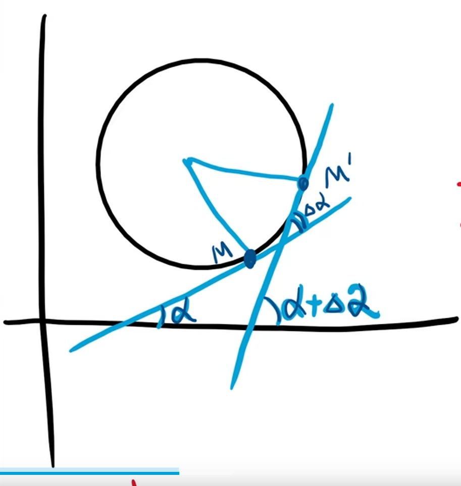

# 曲率
曲线弯曲的程度。

取两个点, 这两个点切线与 x 轴夹角的变化角度 $\Delta \alpha$

1. 平均曲率: $\overline k = |\frac{\Delta \alpha}{\Delta s}|$, 其中 $\Delta s$ 为**两点间的弧长**

2. 在点 $M$ 处的曲率: $k = \lim_{\Delta s \to 0}|\frac{\Delta \alpha}{\Delta s}| = |\frac{d\alpha}{ds}|$

曲率是描述曲线的弯曲程度, 加上绝对值使其**非负**。

## 特殊曲率
1. 直线: $k = 0$ (切线都是这条直线, 夹角不变)
2. 圆: $k = \frac{1}{r}$ (r 为半径)
    
    

    $$

    \begin{align}
    k &= \frac{\Delta \alpha}{\Delta s}\\
    &= \frac{\Delta \alpha}{\frac{\Delta \alpha}{2 \pi} * 2 \pi r}\\
    &= \frac{\Delta \alpha}{\Delta \alpha * r}\\
    &= \frac{1}{r}.
    \end{align}

    $$

    这么理解: 我就往前走一个单位弧长, 我沿着大圆的话, 走了那么一点点, 但是我沿着小圆走的话, 那么我还不知道走到哪里去了, 转过的角度绝对是甩大圆几条街的。

3. $y = f(x)$

    $$

    y' = \tan \alpha\\
    y'' = \sec^2 \alpha\\
    \begin{align}
    &\frac{d \alpha}{dx}\\
    &= \frac{y''}{\sec^2 \alpha}\\
    &= \frac{y''}{1 + \tan^2 \alpha}\\
    &= \frac{y''}{1 + (y')^2}\\
    \end{align}\\
    \therefore d \alpha = \frac{y''}{1 + (y')^2} dx\\
    ds = \sqrt{1 + (y')^2}dx\\
    \therefore \frac{d \alpha}{ds} = |\frac{y''}{[1 + (y')^2]^{\frac{3}{2}}}|.

    $$

    这里的 $ds$ 表示弧长的微小增量，也就是一小段曲线在直角坐标系中的长度。在微分几何中，我们可以使用微元的长度来逼近整个弧长。考虑到微小的弧段可以近似看作一个小直角三角形，其中的斜边长度就是 $ds$。

    在直角三角形中，假设横轴对应于 $dx$，纵轴对应于 $dy$，斜边对应于 $ds$。根据勾股定理，有：

    $ds^2 = dx^2 + dy^2$

    代入 $y' = \frac{dy}{dx}$，得到：

    $ds^2 = dx^2 + (y')^2dx^2$

    整理得：

    $ds = \sqrt{1 + (y')^2}dx$.

    (感谢 ChatGPT 对 $ds$ 的解释)

4. $x = x(t), y = y(t)$

    $$

    tan \alpha(t) = \frac{y'(t)}{x'(t)}\\
    \alpha(t) = \arctan \frac{y'(t)}{x'(t)}\\
    \alpha '(t) = \frac{1}{1 + (\frac{y'}{x'})^2} * \frac{y''x' - x''y'}{(x')^2}\\
    s'(t) = \sqrt{x'^2(t) + y'^2(t)}\\
    \therefore K = \frac{|y''x'-x''y'|}{(x'^2 + y'^2)^{\frac{3}{2}}}.

    $$

    同样的, 
