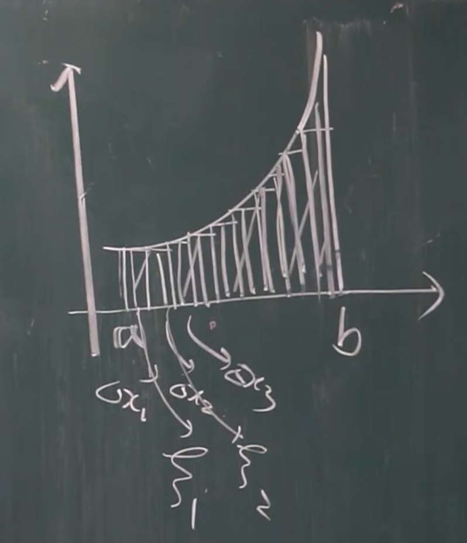

# 定积分
## 概念与性质
* 曲边梯形的面积

    

    分点: $a = x_0<x_1<x_2<...<x_{n-1}<x_n=b$
    
    将这个曲边梯形分成许多个小的长方形, 这些长方形的面积之和, 就是整个曲边梯形的面积。

    设分成的小矩形的长分别为 $\Delta x_1, \Delta x_2 ... \Delta x_n$, 每一个分割点对应的函数值为 $f(\xi_1), f(\xi_2), ... f(\xi_n)$. 这些小矩形的长不一定相等。
    
    则这个曲边梯形的面积, 近似于 $\Delta x_1 * f(\xi_1) + \Delta x_2 * f(\xi_2) + ... + \Delta x_n + f(\xi_n)$.

    记 $\lambda = \max{\Delta x_1, \Delta x_2 ... \Delta x_n}$, $A = \lim_{\Delta x \to 0} \sum_{i = 1}^nf(\xi_i)\Delta x_i$ 则 $A$ 的值, 就和阴影部分的面积非常接近了。

## 定义
$f(x)$ 在 $[a, b]$ 有界, 在 $[a, b]$ 上任意插入若干分点, 分成 $n$ 个小区间 $\Delta x_1, \Delta x_2 ... \Delta x_n$.

 任取一点 $\xi_i$, 则 记 $\lambda = \max{\Delta x_1, \Delta x_2 ... \Delta x_n}$, 如果 $\lim_{\Delta x \to 0} \sum_{i = 1}^nf(\xi_i)\Delta x_i$ 存在, 则该值为 $f(x)$ 在 $[a, b]$ 上的定积分, 记作 $\int_a^b f(x)dx$。

 定积分**只与 $f(x), [a, b]$ 有关**, **与积分变量无关**。