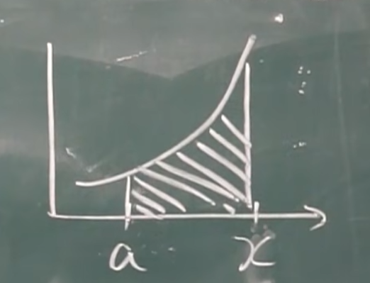

# 微积分的基本公式
## 积分上限函数

$$

\Phi(x) = \int_a^x f(t)dt

$$

前面知道积分结果与积分变量 $t$ 无关, 那么这里 $x$ 才是实际的变量。也就是说, 上限是可变的, 积分上限函数也是**关于 $x$ 的函数**。

### 定理
1. $\Phi'(x) = f(x)$.

    * $\int_x^a f(t)dt = -f(x)$.

    * $\Phi'(\phi(x)) = f(\phi(x))\phi'(x)$.

    * $[\int_{\Phi(x)}^{\phi(x)} f(t)dt]' = f(\phi(x))\phi'(x) - f(\Phi(x))\Phi'(x)$.

2. $\Phi(x) = \int_a^x f(t)dt$ 是 $f(x)$ 的原函数。

## 牛顿-莱布尼茨公式
$$

\int_a^b f(x)dx = F(x)|_a^b = F(b) - F(a).\\
[F(x) 为原函数]

$$

证明:

$$

\Phi(x) = \int_a^x f(t)dt, F(x) 也是原函数, \\
\therefore F(x) - \Phi(x) = c.\\
F(a) - \Phi(a) = c.\\
\therefore \int_a^x f(t)dt = F(x) - F(a)\\
\therefore \int_a^b f(t)dt = F(b) - F(a).

$$

这个公式将定积分转化为不定积分 (原函数), 这一下就简单多了。

## 示例
$$

$$