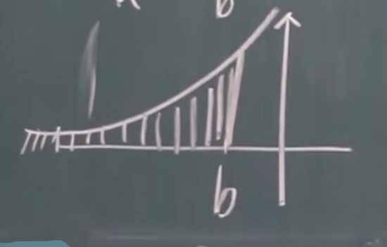

# 无穷限的反常积分

1. 

我想求 $a$ 往右无限远的积分, 我该怎么求?

$$

\int_a^{+\infty} f(x)dx = \lim_{t \to +\infty} \int_a^t f(x) dx = F(x)|_a^{+\infty}.

$$

2. 

$$

\int_{-\infty}^b f(x)dx = \lim_{t \to -\infty} \int_t^b f(x) dx = F(x)|_{-\infty}^b.

$$

3. 两边都是无限

$$

\int_{-\infty}^{+\infty}f(x)dx
= \int_{-\infty}^0 f(x)dx + \int_0^{+\infty}f(x)dx = F(x)|_{-\infty}^{+\infty}.

$$

## 例题
1. $\int_{-\infty}^{+\infty} \frac{dx}{z+x^2}$

$$

\begin{align}
原式 &= \arctan x|_{-\infty}^{+\infty}\\
&=\frac{\pi}{2} - (-\frac{\pi}{2})\\
&= \pi.
\end{align}

$$

2. $\int_0^{+\infty} te^{-pt}dt$

$$

\begin{align}
原式 &= -\frac{1}{p} \int_0^{+\infty} te^{-pt}d(-pt)\\
&= -\frac{1}{p} \int_0^{+\infty} td(e^{-pt})\\
&= -\frac{1}{p} (te^{-pt}|_0^{+\infty} - \int_0^{+\infty} e^{-pt} dt)\\
&= \frac{1}{p^2} [\int_0^{+\infty} e^{-pt}d(-pt)]\\
&= \frac{1}{p^2}.
\end{align}

$$

3. 证明: $\int_a^{+\infty} \frac{dx}{x^p} (a>0)$, 当 $p>1$ 时收敛, $p<1$ 时发散。

$$

\textcircled{1} p=1 时, \\
\begin{align}
&\int_a^{+\infty} \frac{dx}{x}\\
=& \ln x|_a^{+\infty}\\
=& +\infty 发散. 
\end{align}\\~\\

\textcircled{2} p \neq 1 时,\\
\begin{align}
&\int_a^{+\infty} x^{-p}dx\\
=& \frac{1}{1-p} x^{1-p}|_a^{+\infty}\\
=& -\infty (p<1), \frac{a^{1-p}}{p-1}
\end{align}

$$