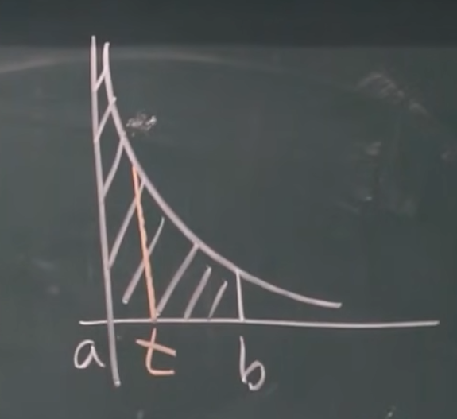

# 无界函数的反常积分
以 $\int_0^1 \frac{1}{x} dx$ 为例,。

$y = \frac{1}{x}$ 在 $x = 0$ 上无定义, 我们把 $x = 0$ 称为**瑕点**, $\int_0^1 \frac{1}{x} dx$ 为**瑕积分**。

那如何求解这样一个瑕积分呢? 

1. 

$$

\int_a^b f(x)dx = \lim_{t \to b^-} \int_a^t f(x)dx.

$$

2. 

$$

\int_a^b f(x)dx = \lim_{t \to a^+} \int_t^b f(x)dx.

$$

3. 

$$

\begin{align}
&\int_a^b f(x)dx\\
=& \int_a^c f(x)dx + \int_c^b f(x)dx\\
=& \lim_{t \to c^-} \int_a^t f(x)dx + \lim_{t \to c^+} \int_t^b f(x)dx.
\end{align}

$$

## 瑕积分的欺骗性
要是忘了瑕积分的话, 可是会出大问题的!

## 例题
7. $\int_0^{+\infty} \frac{1}{\sqrt{x(x+1)^3}}dx$

$$

令 t = \frac{1}{x},\\
则 x = \frac{1}{t}, dx = -\frac{1}{t^2}dt.\\
\begin{align}
原式 &= -\int \frac{1}{\sqrt{(1+t)^3}}dt\\
&= -\int (1+t)^{-\frac{3}{2}}d(1+t)\\
&=2(t+1)^{-\frac{1}{2}}|_0^{+\infty}.
\end{align}

$$