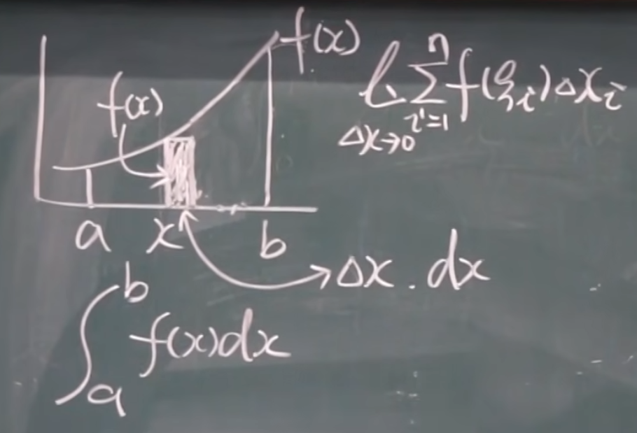
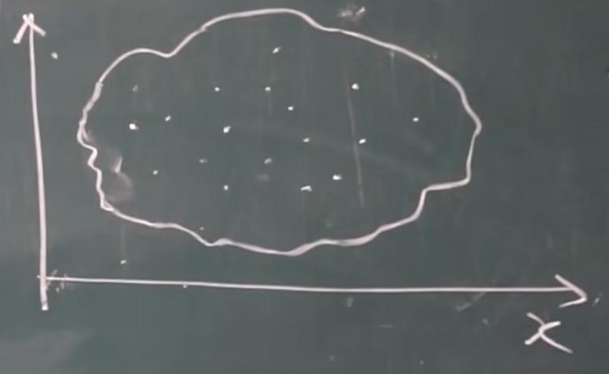
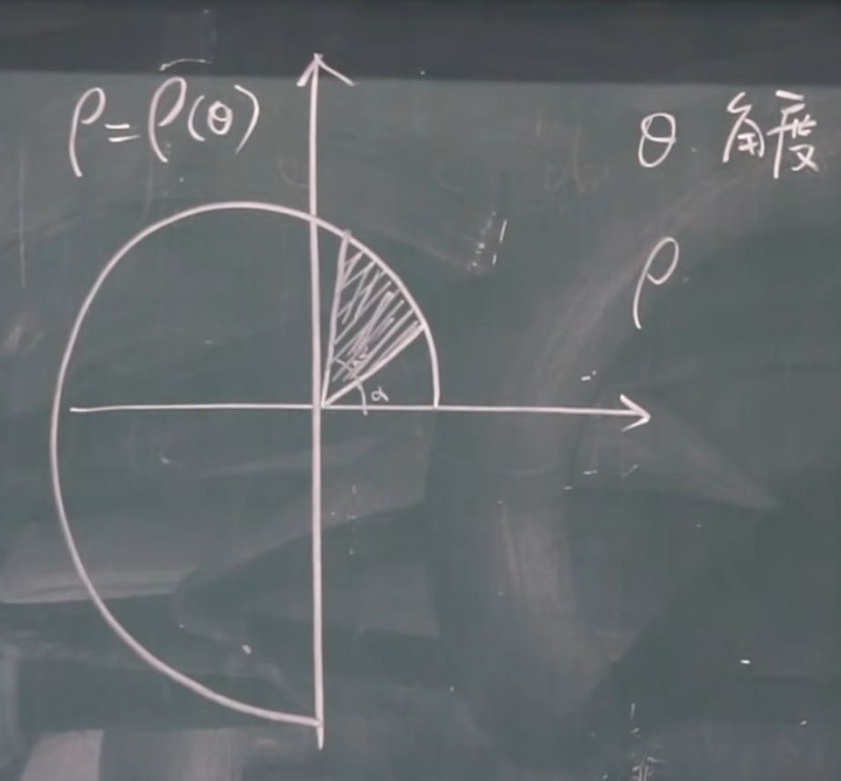

# 元素法
## 求一般函数围成的面积

这个很好理解。其实就是求下面的面积。

## 求不规则物体的体积
规则体的体积我们会求, 但是不规则物体的体积呢?

现在这儿有一块不规则的~~服务器~~, 我想求这块土豆的体积, 该怎么去求呢?

我们不妨把土豆切成一片片小薄片, 每一个小薄片由于**切面变化极小**, 我们可以近似堪称柱体, 用柱体公式 $V = Sh$ 去计算。

每一个小薄片的体积就可以表示为 $V = \lim_{\Delta x \to 0}\Sigma A(\xi_i)\Delta x_i$ ($\xi_i$ 为 $\Delta x$ 内的一个中间量).

整个土豆的体积就可以表示为 $\int_a^b A(x)dx$.

## 求极坐标下一般函数围成的面积

已知 $S_扇 = \frac{r^2 \theta}{2}$.

则 $S = \int_\alpha^\beta \frac{1}{2} \rho^2 d \theta = \frac{1}{2}\int_\alpha^\beta \rho^2 d \theta$