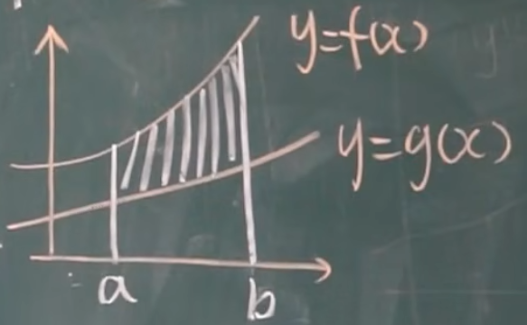
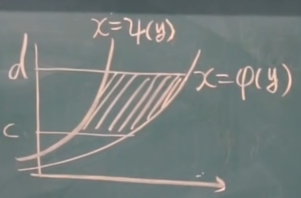

# 定积分应用——求面积
## 平面图形的面积
### $x$ 型区域

$S = \int_a^b f(x)dx - \int_a^b g(x)dx$.

这类图形称为 $x$ **型区域面积**。

其实也就是 $\int_a^b [f(x) -g(x)]dx$, 换句话说, **上减下/上克下**。

### $y$ 型区域
其实就是 $x$ 型区域做个翻转。

$S = \int_c^d [\phi(y) - \psi(y)]dy$, 换句话说就是**右减左**。